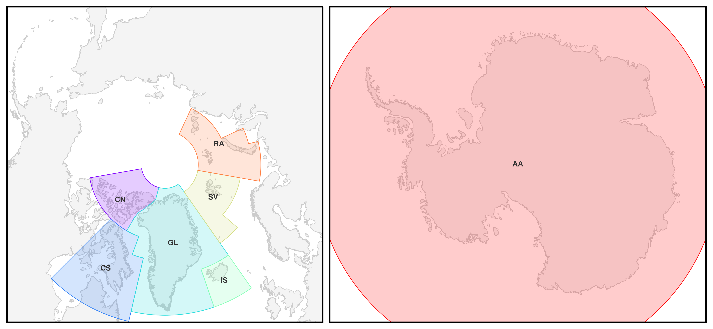

===============
Getting Started
===============

This documentation is intended to explain how to visualize and operate on the ICESat-2 ATL14/15 Gridded Land Ice Height Products.
These products are derived from measurements from the Advanced Topographic Laser Altimeter System (ATLAS),
the primary instrumentation onboard the ICESat-2 observatory.
The data are made available from the NASA DAAC at the `National Snow and Ice Data Center (NSIDC) <https://nsidc.org>`_.
The gridded land ice products are generated using a constrained least-squares technique which fits elevation data
from the `ICESat-2 Slope-Corrected Land Ice Height Time Series (ATL11) <https://nsidc.org/data/atl11/>`_ product.
These products are available for `regions around the Arctic and for the Antarctic ice sheet <./Getting-Started.html#regions>`_.

.. graphviz::
    :caption: ICESat-2 Gridded Land Ice Height Framework
    :align: center

    digraph {
        S [label="Select high-quality ATL11 data" shape=box style="filled" color="gray"]
        M [label="Generate model fitting and regularization matrices" shape=box style="filled" color="gray"]
        L [label="Applying least-squares fitting technique" shape=box style="filled" color="gray"]
        E [label="Calculate model errors" shape=box style="filled" color="gray"]
        S -> M
        M -> L
        L -> E
    }

The products derived from this technique include a static Digital Elevation Model (DEM)
at a reference time `(ATL14) <https://nsidc.org/data/atl14>`_ and
estimates of the elevation change relative to this DEM `(ATL15) <https://nsidc.org/data/atl15>`_.
These products are generated as part of the `same algorithm <https://github.com/smithb/ATL1415>`_
in order to provide a DEM and set of height-change maps that are self-consistent.
The resolution of the ATL14 and ATL15 products is limited by the spatial resolution
of the ICESat-2 tracks, and the temporal sampling of the tracks.
The maximum spatiotemporal resolution of the product is also limited by the smoothness
constraints imposed on the least-squares solution.
Elevation change estimates prior to April 2019 may also be limited due to inconsistencies in the
pointing of the ATLAS instrument during the earliest part of the ICESat-2 mission.

ATL14
#####

The `ICESat-2 ATL14 Gridded Land Ice Height <https://nsidc.org/data/atl15>`_ product contains
the estimated surface height at the reference epoch (midnight at the start of 2020-01-01)
with respect to the WGS84 ellipsoid.
The ATL14 product is available at a high spatial resolution (100 m) and are provided in netCDF4 format.

ATL15
#####

The `ICESat-2 ATL15 Gridded Land Ice Height Change <https://nsidc.org/data/atl15>`_ product contains
quarterly, annual and multi-annual estimates of the land ice height change time series.
The ATL15 product is available at four different spatial resolutions (1 km, 10 km, 20 km and 40 km)
and are provided in netCDF4 format.

Relative Elevation
------------------

Surface height differences relative to the ATL14 DEM are provided in the ``delta_h`` group.
Associated variables within this group include the uncertainties in the relative elevations,
the RMS misfit from the surface change algorithm, the number of ATL11 data points within each grid cell,
and the ice covered area of each grid cell.
Time values in ATL15 are expressed in days since the ICESat-2 standard epoch (midnight at the start of 2018-01-01).

Elevation Change Rate
---------------------

Height-change rates are provided at quarterly (``dhdt_lag1``), annual (``dhdt_lag4``),
and multi-annual (``dhdt_lag8``, ``dhdt_lag12``, etc.) temporal scales.
Within ATL15, a unit of lag is equal to a quarter-year interval, so lag 4 is the height change rate over a single year.
The time values for the height-change rates are equal to the midpoints of underlying relative elevation estimates and
are expressed in days since the ICESat-2 standard epoch (midnight at the start of 2018-01-01).

Regions
#######

ICESat-2 Gridded Land Ice Height products are produced for land ice regions where there are repeat track observations.
Presently the products are produced for the following regions:

- ``AA``: Antarctica
- ``CN``: Northern Canadian Archipelago
- ``CS``: Southern Canadian Archipelago
- ``GL``: Greenland
- ``IS``: Iceland
- ``SV``: Svalbard
- ``RA``: Russian High Arctic

Coordinate Reference System
###########################

The gridded products are available as polar stereographic grids.
The Northern Hemisphere regions (``CN``, ``CS``, ``GL``, ``IS``, ``SV``, ``RA``)
are projected in the `EPSG:3413 <https://epsg.io/3413>`_ coordinate reference system.

+--------------------------------+-----------------------------------------+
|           Description          |                  Value                  |
+================================+=========================================+
| Projected coordinate system    | NSIDC Sea Ice Polar Stereographic North |
+--------------------------------+-----------------------------------------+
| Spatial EPSG                   | `3413 <https://epsg.io/3413>`_          |
+--------------------------------+-----------------------------------------+
| Longitude of projection origin | -45\ |degree|\ E                        |
+--------------------------------+-----------------------------------------+
| Latitude of projection origin  | +90\ |degree|\ N                        |
+--------------------------------+-----------------------------------------+
| Standard Parallel              | +70\ |degree|\ N                        |
+--------------------------------+-----------------------------------------+
| Ellipsoid                      | WGS 84                                  |
+--------------------------------+-----------------------------------------+
| Units                          | meters                                  |
+--------------------------------+-----------------------------------------+

The Southern Hemisphere regions (``AA``)
are projected in the `EPSG:3031 <https://epsg.io/3413>`_ coordinate reference system.

+--------------------------------+-----------------------------------------+
|           Description          |                  Value                  |
+================================+=========================================+
| Projected coordinate system    | Antarctic Polar Stereographic           |
+--------------------------------+-----------------------------------------+
| Spatial EPSG                   | `3031 <https://epsg.io/3031>`_          |
+--------------------------------+-----------------------------------------+
| Longitude of projection origin | +0\ |degree|\ E                         |
+--------------------------------+-----------------------------------------+
| Latitude of projection origin  | -90\ |degree|\ N                        |
+--------------------------------+-----------------------------------------+
| Standard Parallel              | -71\ |degree|\ N                        |
+--------------------------------+-----------------------------------------+
| Ellipsoid                      | WGS 84                                  |
+--------------------------------+-----------------------------------------+
| Units                          | meters                                  |
+--------------------------------+-----------------------------------------+

IS2view
#######

``IS2view`` is an `rioxarray <https://corteva.github.io/rioxarray/>`_ extension for
interactively plotting the gridded ICESat-2 products using `ipyleaflet <https://ipyleaflet.readthedocs.io/>`_.
``IS2view`` visualizes the ICESat-2 data as ImageService layers, which only renders data within the displayed map bounds.
This limits the visualization to only parts of the total data product at any given time.
``IS2view`` visualizes the data in the `native projection of each dataset (EPSG:3413 and EPSG:3031) <./Getting-Started.html#coordinate-reference-system>`_.
The data can be visualized using `different colormaps <https://matplotlib.org/stable/tutorials/colors/colormaps.html>`_ and
with `different normalizations <https://matplotlib.org/stable/tutorials/colors/colormapnorms.html>`_.
Different variables and plot parameters can be selected using `Jupyter Widgets interactive browser controls <https://ipywidgets.readthedocs.io/>`_.
More detailed usage can be found in the `Examples <../user_guide/Examples.html>`_ and `Recipes <../user_guide/Recipes.html>`_.

References
##########

- `NSIDC User Guide for ATL14 <https://nsidc.org/sites/default/files/documents/user-guide/atl14-v002-userguide.pdf>`_
- `NSIDC User Guide for ATL15 <https://nsidc.org/sites/default/files/documents/user-guide/atl15-v002-userguide.pdf>`_
- `Algorithm Theoretical Basis Document for ATL14 and ATL15 <https://nsidc.org/sites/default/files/documents/technical-reference/icesat2_atl14_atl15_atbd_r002.pdf>`_

.. |degree|    unicode:: U+00B0 .. DEGREE SIGN
