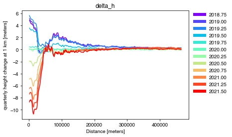
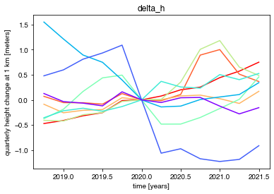
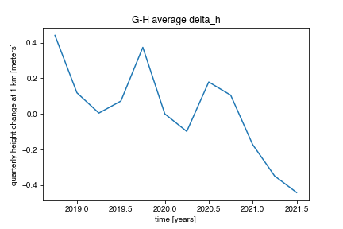
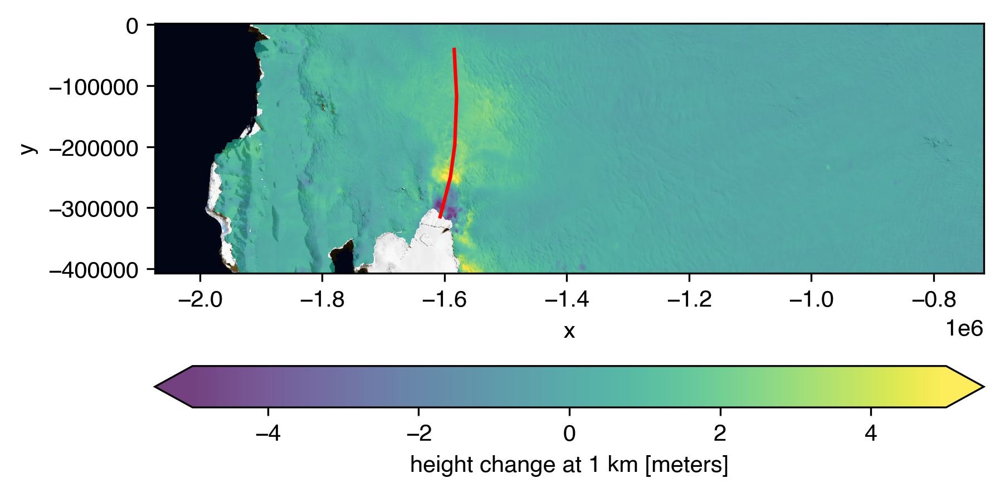

.. _recipes:

=======
Recipes
=======

Add Contextual Layers
#####################

- `ArcticDEM <https://www.pgc.umn.edu/data/arcticdem>`_ (NSIDC Sea Ice Polar Stereographic North, `EPSG:3413 <https://epsg.io/3413>`_)

   Provided by `Esri Polar/ArcticDEM ImageServer <https://elevation2.arcgis.com/arcgis/rest/services/Polar/ArcticDEM/ImageServer>`_

.. code-block:: python

   m.add(IS2view.image_service_layer('ArcticDEM'))

- `Reference Elevation Model of Antarctica <https://www.pgc.umn.edu/data/rema>`_ (Antarctic Polar Stereographic, `EPSG:3031 <https://epsg.io/3031>`_)

   Provided by `Esri Polar/AntarcticDEM ImageServer <https://elevation2.arcgis.com/arcgis/rest/services/Polar/AntarcticDEM/ImageServer>`_

.. code-block:: python

   m.add(IS2view.image_service_layer('REMA'))

Plot a Transect
###############

.. code-block:: python

   import geopandas
   # read shapefile of glacial flowlines
   gdf = geopandas.read_file('/vsizip/shapefiles.zip/glacier0001.shp')
   # add geodataframe
   m.add_geodataframe(gdf)
   # iterate over features
   for feature in m.geometries['features']:
      ds.timeseries.plot(feature, cmap='rainbow', legend=True,
         variable=IS2widgets.variable.value,
      )

   Greenland glacier flowlines from `Felikson et al. (2020) <https://zenodo.org/record/4284759>`_

Plot Multiple Time Series
#########################

.. code-block:: python

   import fiona
   fiona.drvsupport.supported_drivers['LIBKML'] = 'rw'
   import geopandas
   import numpy as np
   import matplotlib.pyplot as plt
   # read kml file with subglacial lake outlines
   gdf = geopandas.read_file('lake_outlines.kml')
   # add geodataframe of Whillians ice stream subglacial lakes
   m.add_geodataframe(gdf[gdf['names'].str.startswith('Whillians')])
   # create figure axis
   fig, ax = plt.subplots()
   fig.patch.set_facecolor('white')
   # plot colors for each geometry
   n_features = len(m.geometries['features'])
   plot_colors = iter(plt.cm.rainbow_r(np.linspace(0,1,n_features)))
   # iterate over features
   for geo in m.geometries['features']:
      color = next(plot_colors)
      ds.timeseries.plot(geo, ax=ax,
         variable=IS2widgets.variable.value,
         color=color
      )
   # show combined plot
   plt.show()

   Antarctic subglacial lake delineations from `Fricker et al. (2007) <https://doi.org/10.1126/science.1136897>`_

Calculate Area Averages
#######################

.. code-block:: python

   import geopandas
   import numpy as np
   import matplotlib.pyplot as plt
   import matplotlib.colors as colors
   # data release and variable
   release = IS2widgets.release.value
   variable = IS2widgets.variable.value
   # read shapefile with drainage outlines
   gdf = geopandas.read_file('IceBoundaries_Antarctica_v02.shp')
   # get unique list of subregions
   subregions = gdf[gdf['TYPE'] == 'GR']['Subregions'].unique()
   # plot colors for each subregion
   n_features = len(subregions)
   plot_colors = iter(plt.cm.rainbow_r(np.linspace(0,1,n_features)))
   # iterate over subregions
   for subregion in sorted(subregions):
      # add geodataframe of drainages within subregion
      color = colors.to_hex(next(plot_colors))
      data = gdf[(gdf['TYPE'] == 'GR') & (gdf['Subregions'] == subregion)]
      m.add_geodataframe(data, style=dict(color=color))
      # allocate for combined area and volume
      area = np.zeros_like(ds.time, dtype=np.float64)
      volume = np.zeros_like(ds.time, dtype=np.float64)
      # iterate over features
      for geo in m.geometries['features']:
         ds.timeseries.extract(geo, variable=variable)
         # add to total area and volume
         area += ds.timeseries._area
         volume += ds.timeseries._area*ds.timeseries._data
      # create output figure
      fig, ax = plt.subplots()
      fig.patch.set_facecolor('white')
      ax.plot(ds.timeseries._time, volume/area)
      ax.set_xlabel('{0} [{1}]'.format('time', 'years'))
      ax.set_ylabel('{0} [{1}]'.format(ds.timeseries._longname, ds.timeseries._units))
      ax.set_title('{0} average {1}'.format(subregion,variable))
      # set axis ticks to not use constant offset
      ax.xaxis.get_major_formatter().set_useOffset(False)
      # save average plot
      plt.savefig(f'ATL15_{release}_{subregion}_{variable}.pdf')
      # drop features for subregion
      m.geometries['features'] = []

   MEaSUREs Antarctic Boundaries from `Mouginot et al. (2017) <https://nsidc.org/data/NSIDC-0709/versions/2>`_

Save a Map to a File
####################

.. code-block:: python

   import matplotlib.pyplot as plt
   # create a figure and axis
   fig,ax = plt.subplots()
   # create image of current map
   ds.leaflet.imshow(ax=ax)
   # add all geometries to the map
   m.plot(ax=ax, color='red')
   # save map plot
   plt.savefig('map.png', bbox_inches='tight', dpi=300)

